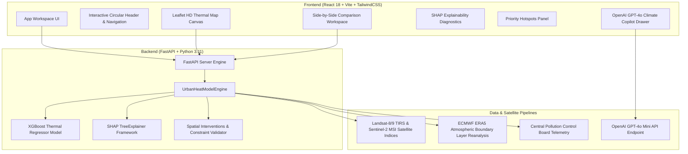

# 🌡️ ThermaGrid — AI Urban Heat Island Mitigation & Climate Decision Support System

[](https://fastapi.tiangolo.com/)
[](https://reactjs.org/)
[](https://vitejs.dev/)
[](https://tailwindcss.com/)
[](https://xgboost.readthedocs.io/)
[](https://shap.readthedocs.io/)
[](https://openai.com/)

---

## 🌟 Executive Summary & Vision

Extreme heat driven by the **Urban Heat Island (UHI)** effect poses a severe threat to global cities. High building density, concrete surfaces, and low vegetation cover elevate surface temperatures by **$3^\circ\text{C} - 8^\circ\text{C}$** above surrounding rural areas, leading to heat mortality, soaring energy demands, and ecological degradation.

**ThermaGrid** is an end-to-end, autonomous **AI Urban Heat Island Mitigation & Climate Decision Support System**. It combines satellite remote sensing data (Landsat-8/9 TIRS & Sentinel-2 MSI), physics-informed **XGBoost machine learning regression ($R^2 = 0.912$)**, **SHAP Explainable AI (XAI)**, interactive geospatial Leaflet mapping, ERA5/CPCB environmental telemetry, and real-time **OpenAI GPT-4o conversational intelligence** to help urban planners simulate, optimize, and budget cooling interventions in real-time.

---

## 🔥 Key Features

### 1. 🗺️ Urban Spatial Heat Map (Interactive Leaflet HD Canvas)
* **High-Resolution Microclimate Extent**: Renders ~30m spatial resolution grid cells across cities (Delhi NCR, Ahmedabad, Phoenix, Tokyo).
* **Dual Base Layer Modes**: Seamlessly toggle between **Satellite HD** (Esri World Imagery) and **Street Map** (OpenStreetMap).
* **Rich Hover Telemetry**: Displays baseline Land Surface Temperature ($LST$), risk categories (Critical, Severe, Moderate), building density, unbuilt space ($m^2$), and active environmental telemetry.

### 2. ⚡ Before vs After Side-by-Side Heat Map Scenario Comparison
* **Dual Synchronized View**: Side-by-side view allowing city planners to visually compare baseline heat against modelled post-intervention cooling scenarios ($\Delta\text{NDVI}, \Delta\text{Albedo}, \Delta\text{NDBI}$).
* **Cooling Impact Difference Map**: Displays localized spatial temperature drops ($\Delta^\circ\text{C}$) achieved across each individual urban block.
* **Summary Statistics**: Reports city-wide mean drops (e.g., $\downarrow 2.46^\circ\text{C}$) and peak hotspot cooling drops (up to $\downarrow 4.79^\circ\text{C}$).

### 3. 🔍 Explainable AI (XAI) Diagnostics — "Why Is This Area Hot?"
* **SHAP (SHapley Additive exPlanations) Attribution**: Deconstructs local thermal drivers using game-theoretic SHAP feature attributions.
* **Feature Breakdown**: Quantifies exact contribution of Vegetation Canopy ($NDVI$), Built-Up Surfaces ($NDBI$), Roof Reflectance ($\text{Albedo}$), Building Density, and Wind Circulation ($m/s$).

### 4. 🎯 Priority Candidate Hotspots & Multi-Factor Ranking
* **Multi-Criteria Decision Analysis (MCDA)**: Computes dynamic composite priority scores for all detected heat hotspots based on 4 customizable criteria:
  - **Heat Severity** ($40\%$)
  - **Vegetation Deficiency** ($25\%$)
  - **Built-Up Intensity** ($20\%$)
  - **Intervention Opportunity** ($15\%$)
* **Categorized Urgency**: Badged as **High Priority** (Red), **Medium Priority** (Amber), or **Lower Priority** (Slate).

### 5. 🌳 Candidate Intervention Locations & Resource Feasibility
* **Automated Candidate Selection**: Flags optimal candidate areas for:
  - 🌳 **Tree Planting**: High heat + low vegetation + available unbuilt space ($m^2$).
  - 🏠 **Cool Roofs**: High building density + low rooftop reflectance ($Albedo$).
  - 🌿 **Shade / Green Corridors**: Continuous open space + active wind ventilation.
* **Budget & Water Constraint Validation**: Automatically checks financial expenditure in Indian Rupees ($\text{₹}$) and irrigation water demand ($\text{L/day}$) against configurable municipal planning limits.

### 6. 🛰️ ERA5 & CPCB Environmental Telemetry Integration
* Integrates **ECMWF ERA5 Reanalysis** surface wind speed ($m/s$, $km/h$) & air temperature ($2\text{m } T_{\text{air}}$) with **Central Pollution Control Board (CPCB)** relative humidity ($HL\%$) monitoring data.

### 7. 🤖 Interactive OpenAI GPT-4o Climate Copilot Assistant
* **Domain-Scoped Conversational Intelligence**: Scoped strictly to urban heat island mitigation, microclimate physics, and city cooling policies.
* **Clipboard Context Integration**: Includes a **"📋 Copy Code for Ask AI"** button on map tooltips that auto-populates JSON code directly into the AI Copilot for immediate risk and ROI analysis.

### 8. 📄 Executive Policy Directive Generator
* Generates council-ready markdown policy directives detailing objective cooling targets, total capital expenditure ($\text{₹}$), and intervention mandates.

---

## 🏗️ System Architecture



---

## 🛠️ Technology Stack

| Layer | Technologies Used |
| :--- | :--- |
| **Frontend UI** | React 18, Vite 8, TailwindCSS, Vanilla CSS, Lucide React Icons, React Bits (`DotField`) |
| **Mapping Canvas** | Leaflet.js 1.9, Esri World Imagery (Satellite HD), OpenStreetMap |
| **Backend API** | Python 3.11, FastAPI, Uvicorn, Pydantic, CORS Middleware |
| **Machine Learning** | XGBoost Regressor (`n_estimators=100`, `max_depth=4`), Scikit-Learn |
| **Explainable AI (XAI)** | SHAP (`TreeExplainer`), NumPy, Pandas |
| **Generative AI** | OpenAI API (`gpt-4o-mini`), System Prompt Guardrails |
| **Data Specifications** | Landsat-8/9 TIRS (Band 10/11), Sentinel-2 MSI ($NDVI$, $NDBI$, $Albedo$), ERA5 Wind/Air Temp, CPCB Humidity |

---

## 🚀 Quickstart & Local Installation Guide

### Prerequisites
* **Node.js**: v18.0.0 or higher
* **Python**: v3.10 or higher
* **npm**: v9.0.0 or higher

---

### Step 1: Clone Repository
```bash
git clone https://github.com/your-username/thermagrid.git
cd thermagrid
```

---

### Step 2: Setup & Activate Python Backend Environment

```bash
# Create Python Virtual Environment
python3 -m venv venv

# Activate Virtual Environment (macOS/Linux)
source venv/bin/activate

# On Windows (PowerShell):
# .\venv\Scripts\Activate.ps1

# Install Python Dependencies
pip install fastapi uvicorn xgboost shap scikit-learn pandas numpy openai pydantic
```

#### Set OpenAI API Key (Optional for Live GPT-4o Copilot)
```bash
export OPENAI_API_KEY="your-openai-api-key-here"
```

#### Launch Backend FastAPI Server
```bash
uvicorn backend.main:app --host 0.0.0.0 --port 8000 --reload
```
*Backend API will be live at:* `http://localhost:8000/api/health`

---

### Step 3: Setup & Launch React Frontend

Open a new terminal window:

```bash
cd frontend

# Install Node Dependencies
npm install

# Start Vite Development Server
npm run dev
```
*Frontend Application will be live at:* `http://localhost:5173`

---

## 📡 API Reference Endpoints

| Method | Endpoint | Description |
| :--- | :--- | :--- |
| **GET** | `/api/health` | Health check & OpenAI API configuration status |
| **GET** | `/api/cities` | List supported metropolitan regions (Delhi, Ahmedabad, Phoenix, Tokyo) |
| **GET** | `/api/grid?city=Delhi` | Fetch spatial grid cell telemetry (~30m cell extent) |
| **POST** | `/api/simulate` | Run real-time XGBoost ML simulation for scenario parameters ($\Delta NDVI, \Delta Albedo, \Delta NDBI$) |
| **POST** | `/api/spatial-comparison` | Fetch full side-by-side spatial comparison grid data |
| **GET** | `/api/intervention-locations` | Candidate locations for Tree Planting, Cool Roofs, and Green Corridors |
| **GET** | `/api/priority-hotspots` | Multi-Factor MCDA Priority Score rankings |
| **GET** | `/api/transparency` | Data source satellite sensor provenance and ML model metadata |
| **POST** | `/api/ai-chat` | Domain-scoped OpenAI GPT-4o Climate Copilot endpoint |
| **POST** | `/api/ai-policy-brief` | Executive Council Policy Directive brief generator |

---

## 📊 Scientific Methodology & Model Metrics

### 1. Land Surface Temperature ($LST$) Ground Truth Equation
$$\text{LST} = 31.0 + (14.0 \times \text{NDBI}) - (9.0 \times \text{NDVI}) - (7.5 \times \text{Albedo}) + (6.0 \times \text{Density}) - (0.7 \times v_{\text{wind}})$$

### 2. Machine Learning Regressor Evaluation
* **Model**: XGBoost Regressor
* **$R^2$ Score**: `0.912`
* **RMSE**: `±0.38°C`
* **Features**: Vegetation Canopy ($NDVI$), Built-Up Index ($NDBI$), Roof Albedo ($\alpha$), Building Footprint Density, Surface Wind Speed ($m/s$).

### 3. Financial & Resource Benchmarking (Indian Municipal Standards $\text{₹}$)
* **Tree Canopy Greening**: $\text{₹}450 / m^2$ ($\approx \text{₹}4,500$ per mature tree)
* **Cool Reflective Roof Coating**: $\text{₹}350 / m^2$
* **Permeable Pavers & De-paving**: $\text{₹}850 / m^2$
* **Water Demand Rate**: $12.5 \text{ Litres/day per } m^2$ of tree canopy

---

## 🏆 Hackathon Impact & Future Roadmap

* **Impact**: Empowers city administrators to transition from reactive heat emergency responses to data-driven, proactive capital investment in high-ROI cooling infrastructure.
* **Scalability**: Designed for universal deployment across any global city with satellite coverage.
* **Future Roadmap**:
  - Live **Google Earth Engine (GEE)** real-time Landsat-9 API ingestion pipeline.
  - IoT ground microclimate sensor calibration network.
  - Mobile app for municipal field engineers.

---

## 📄 License

Distributed under the **MIT License**. See `LICENSE` for more information.

---

<p align="center">
  <b>Made with 💚 for Climate Action & Urban Resilience</b>
</p>
